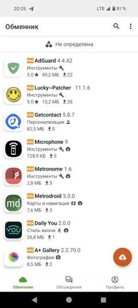
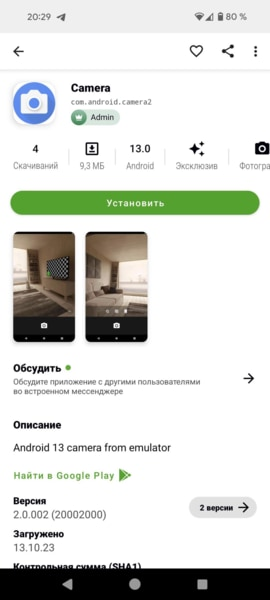
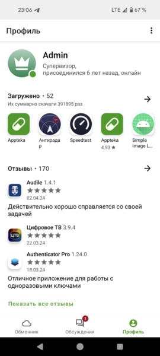
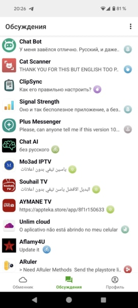

# Appteka 

Appteka is a free Android apps market.  
Download **[Appteka](https://appteka.store)** to get access to hundreds of thousands of free Android apps made by developers all around the world.

---

## 📸 Screenshots

### ⭐ Main Screens
| Home | App Details |
|------|-------------|
|  |  |

### ⭐ Upload & Profile
| Upload Screen | Profile Screen |
|---------------|----------------|
|  |  |

### ⭐ Topics & Chat
| Topics | Chat |
|--------|------|
|  |  |

---

## 📝 Changelog (Custom Build by Ameer Muawiya)

> **Note:**  
> This is a customized build of **Appteka**.  
> **All original credit belongs solely to the official Appteka developers.**  
> This build only includes visual and functional improvements while preserving the core project.

### 🚀 Recent Changes & Enhancements
- Complete UI migration to **Material 3 Expressive** design system.
- Added **Download button pinning** on the home screen for quicker access.
- Introduced an option to **save downloaded files directly to device storage**.
- Fully redesigned **Settings Activity** using modern Material 3 patterns.
- Migrated **all dialogs** to Material 3 components.
- Added four theme modes: **System**, **Light**, **Dark**, and **Battery Saver** (for older devices).
- Added toggle for **Dynamic Colors** (Monet / Material You).
- Fixed a crash in **Store Fragment** when opening certain apps.
- Numerous UI refinements, improved spacing, better animations, and smoother transitions.
- Various bug fixes and performance improvements across the app.

---

## 👤 Custom Build Contributor
- **Modified & Enhanced by:** *Ameer Muawiya*

## 🎖 Full Credit
All original code and development work belongs to the  
**Official Appteka Developers** — they deserve full recognition for creating this project.