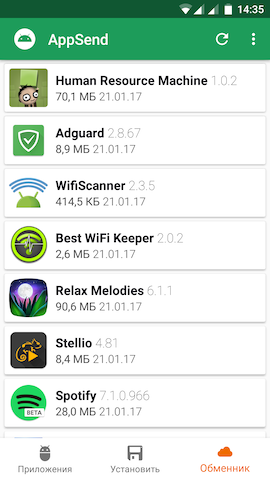
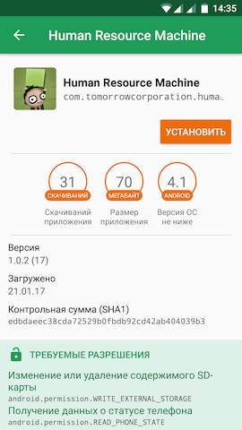

# Appteka 
Appteka is an alternative store for Android. It also can extracts APKs, are installed on your Android device and cope them into your SD card.

* Fast and easy to use.
* Extracts almost all application, including system applications.
* No ROOT access required. 
* Upload Apk's to special Appteka.Store.
* Provided Search option to search applications.
* Support features of Android 7.0
* Can backup and install Apk's from your SD Card.
* Install free apps from Appteka.Store.
* Discuss apps and games with other Appteka users in realtime chat!

